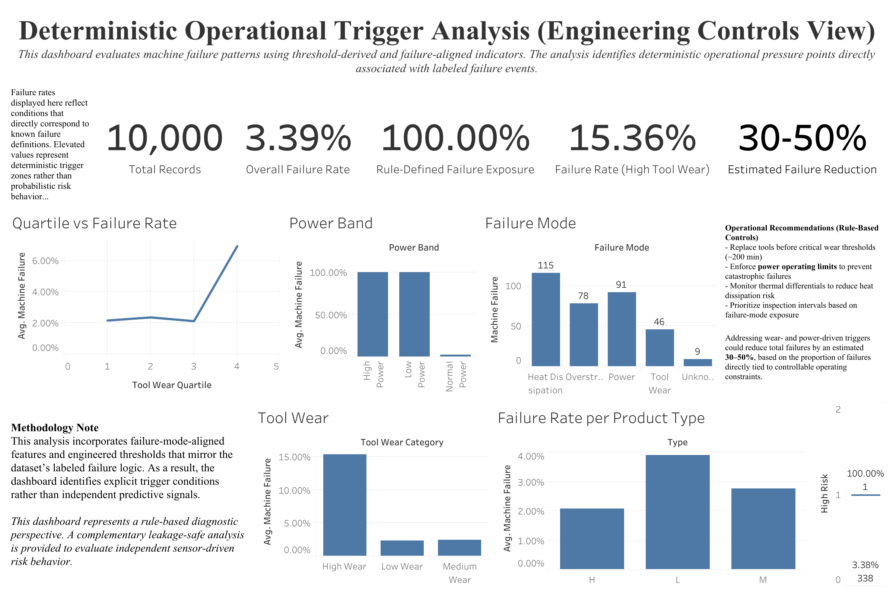
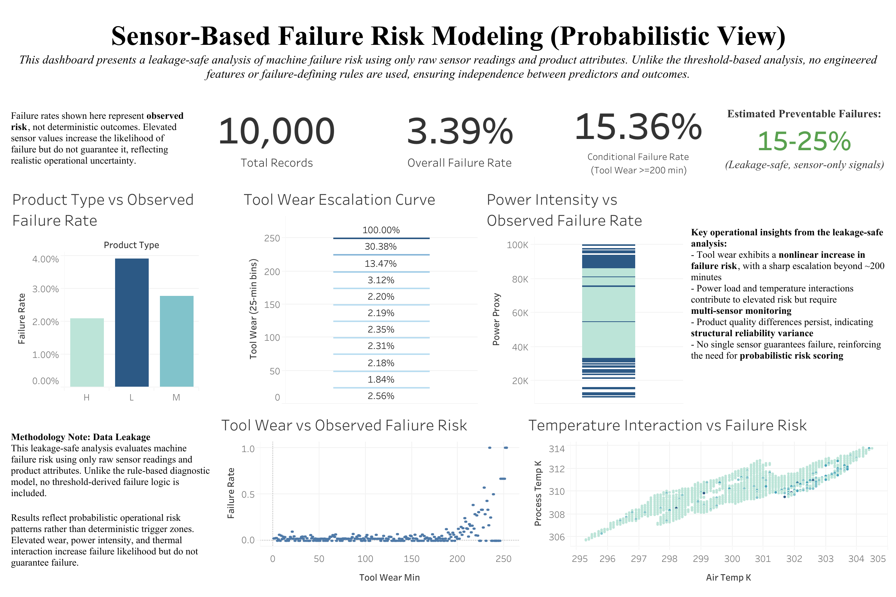
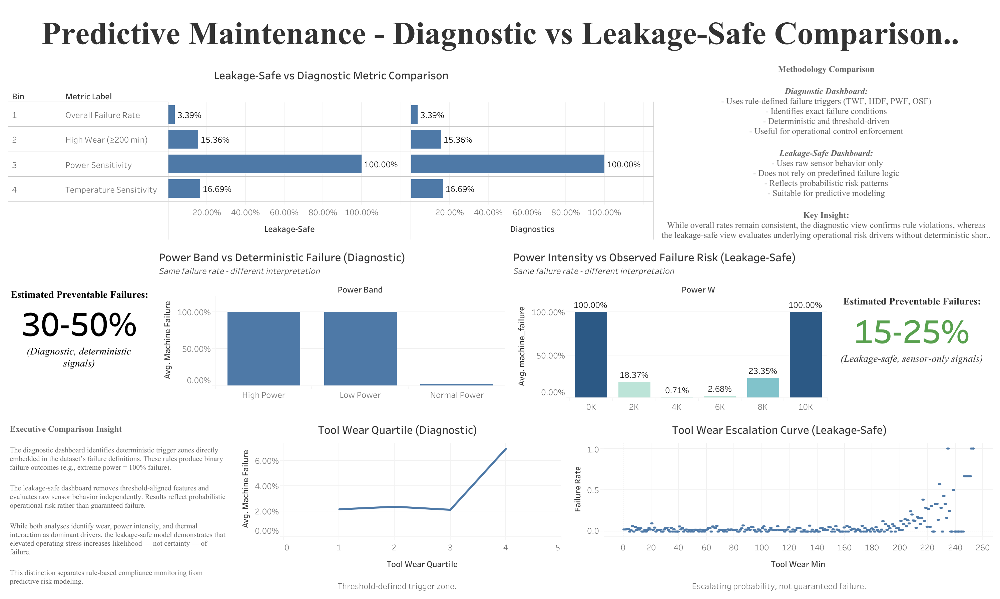

Tableau Dashboards

This folder contains executive dashboards developed in Tableau Public for the project:

Predictive Maintenance: Diagnostic vs Leakage-Safe Analysis

These dashboards translate SQL-based analysis into operational decision tools for manufacturing environments.

⸻

1) Diagnostic Failure Analysis (Rule-Based)

Purpose:
Evaluate failure behavior using rule-aligned thresholds directly tied to dataset failure definitions.

Key Characteristics:
	•	Uses deterministic trigger logic (TWF, HDF, PWF, OSF)
	•	Identifies exact failure zones (e.g., power extremes)
	•	Highlights compliance-driven operational control opportunities
	•	Suitable for rule-based maintenance enforcement

Insight Type: Deterministic / Compliance Monitoring

⸻

2) Leakage-Safe Risk Analysis (Sensor-Only)

Purpose:
Evaluate failure risk using independent raw sensor signals without embedding failure-defining logic.

Key Characteristics:
	•	Removes threshold-derived leakage
	•	Models probabilistic operational risk behavior
	•	Demonstrates nonlinear wear escalation
	•	Supports predictive modeling strategy

Insight Type: Probabilistic / Risk Modeling

⸻

3) Diagnostic vs Leakage-Safe Comparison

Purpose:
Directly compare deterministic and probabilistic analytical frameworks.

Highlights:
	•	Side-by-side KPI comparison
	•	Power zone distortion illustration
	•	Tool wear escalation contrast
	•	Preventable failure estimate comparison

Executive Takeaway:
Rule-based logic produces guaranteed failure zones, while leakage-safe modeling evaluates operational likelihood. This distinction separates compliance monitoring from predictive risk analytics.

⸻

Tableau Public Links

Diagnostic Dashboard
https://public.tableau.com/views/PredictiveMaintenanceAnalysisDiagnostic/PredictiveMaintenanceAnalysis?:language=en-US&:sid=&:redirect=auth&:display_count=n&:origin=viz_share_link

Diagnostic Dashboard Preview

Leakage-Safe Dashboard
https://public.tableau.com/views/PredictiveMaintenanceAnalysisLeakage-Safe/Leakage-SafeDashboard?:language=en-US&:sid=&:redirect=auth&:display_count=n&:origin=viz_share_link

Leakage-Safe Dashboard Preview

Comparison Dashboard
https://public.tableau.com/views/PredictiveMaintenance-DiagnosticvsLeakage-SafeComparison/DashboardComparison-DiagnosticvsLeakage-Safe?:language=en-US&:sid=&:redirect=auth&:display_count=n&:origin=viz_share_link

Comparison Dashboard Preview

